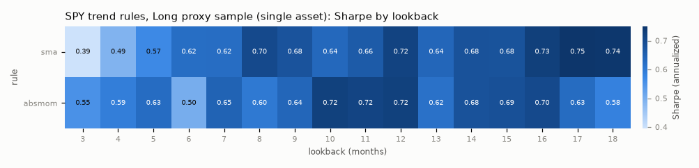
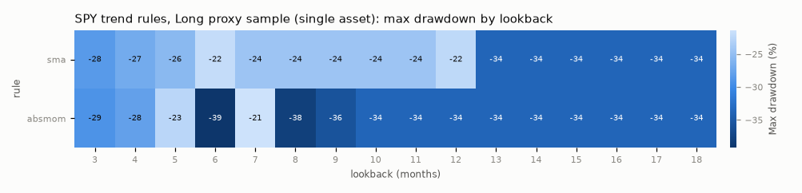
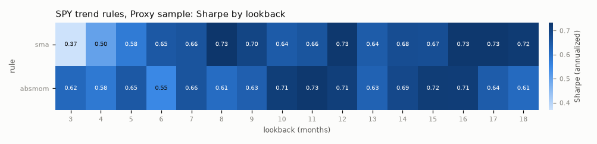
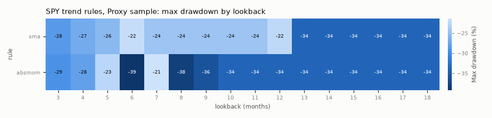
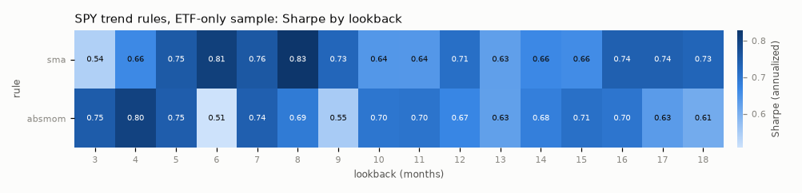
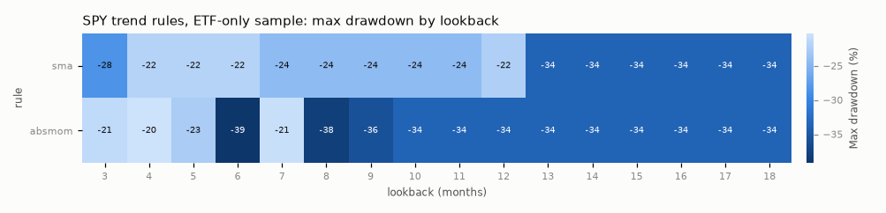
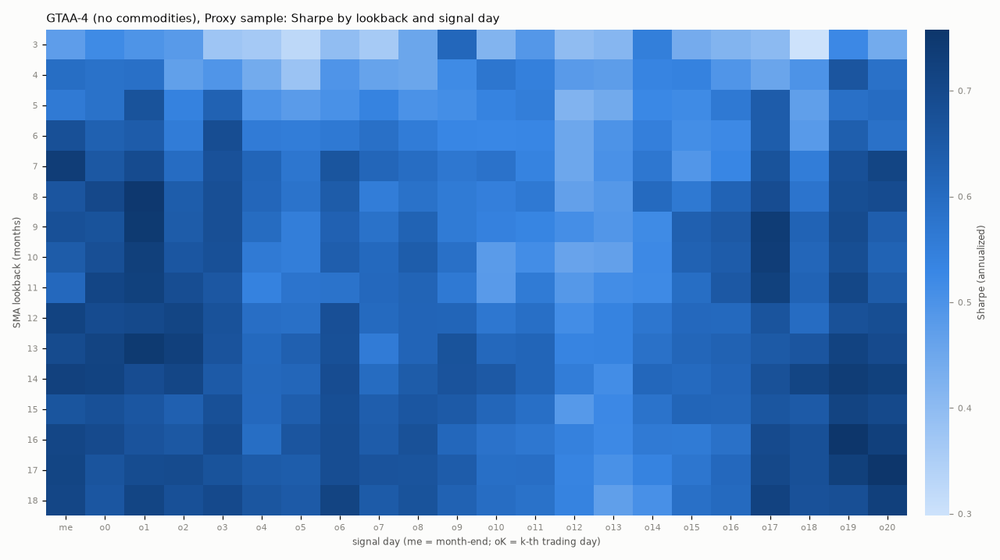
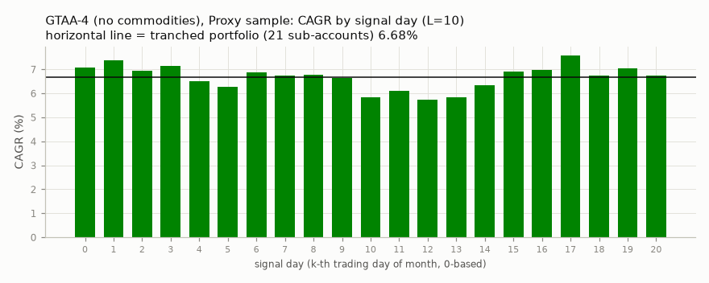
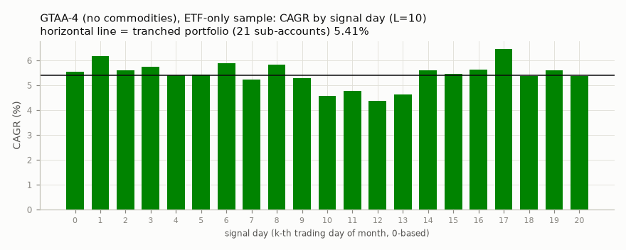
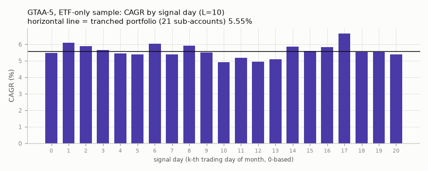

# Parameter plateaus and rebalance-day dispersion

> **Important: hypothetical backtested performance.** Every number in this report is a *simulation* of what the stated rules would have done on historical data. No money was traded. Simulated results have inherent limitations: they are produced with hindsight, cannot reflect real fills, taxes or the behaviour of a person following the rules through losses, and are known to overstate live results.
>
> - **Costs modelled (results are net of these):** half-spread per instrument floored at 5 bp per side (the Gate A floor), Alpaca pass-through regulatory fees (SEC, FINRA TAF, CAT; each rounded up to the cent per day), Alpaca's $1 minimum on buy orders (sells have no minimum), $10,000 starting capital, fractional shares, fills at the next day's open; fund expense ratios are inside fund prices. Taxes, market impact and dividend withholding are NOT modelled. Every table in this file uses this tier at 1x (no 2x-cost rows).
> - **Sample period:** Long proxy sample (single asset) 1988-08..2026-08; Proxy sample 1996-06..2026-08; ETF-only sample 2006-03..2026-08
> - **Benchmark shown alongside every strategy:** none in this file (parameter sweeps of the candidates); SPY buy-and-hold is alongside every strategy in summary.md
> - **Worst drawdown in these results:** -39.2% (trend variant absmom_L6, ETF-only sample, daily closes)
> - **Number of variants tried (trial ledger):** 546 unique variants in results/trial_ledger.json (long: 38, proxy: 392, etf: 116). The more variants tried, the more the best one is flattered by luck; see dsr_pbo.md for the correction.
> - **Past performance does not indicate future results.** Nothing here is investment advice.
> - Generated by `scripts/run_backtests.py` (deterministic Python, no language model) on 2026-09-29 (UTC date).

Plateau statistic: worst Sharpe among lookbacks within +-25% of the default, divided by the default's Sharpe (Gate A.5 needs >= 0.70). All runs: gate cost tier, $10,000, next-open fills.

| sample / family | center | center_sharpe | neighbors | min_retained | mean_retained | worst_neighbor |
|---|---|---|---|---|---|---|
| long / trend_sma | 10 | 0.64 | 8,9,10,11,12 | 1.00 | 1.07 | 10 |
| long / trend_absmom | 12 | 0.72 | 9,10,11,12,13,14,15 | 0.85 | 0.95 | 13 |
| proxy / trend_sma | 10 | 0.64 | 8,9,10,11,12 | 1.00 | 1.07 | 10 |
| proxy / trend_absmom | 12 | 0.71 | 9,10,11,12,13,14,15 | 0.89 | 0.97 | 13 |
| etf / trend_sma | 10 | 0.64 | 8,9,10,11,12 | 1.00 | 1.11 | 11 |
| etf / trend_absmom | 12 | 0.67 | 9,10,11,12,13,14,15 | 0.82 | 0.99 | 9 |
| proxy / gtaa4 | 10 | 0.64 | 8,9,10,11,12 | 0.94 | 1.03 | 11 |
| etf / gtaa5 | 10 | 0.58 | 8,9,10,11,12 | 0.91 | 1.00 | 11 |
| etf / gtaa4 | 10 | 0.56 | 8,9,10,11,12 | 0.86 | 0.99 | 11 |

## SPY trend rules, Long proxy sample (single asset)

Sharpe by lookback (months):

| rule | 3 | 4 | 5 | 6 | 7 | 8 | 9 | 10 | 11 | 12 | 13 | 14 | 15 | 16 | 17 | 18 |
|---|---|---|---|---|---|---|---|---|---|---|---|---|---|---|---|---|
| sma | 0.39 | 0.49 | 0.57 | 0.62 | 0.62 | 0.70 | 0.68 | 0.64 | 0.66 | 0.72 | 0.64 | 0.68 | 0.68 | 0.73 | 0.75 | 0.74 |
| absmom | 0.55 | 0.59 | 0.63 | 0.50 | 0.65 | 0.60 | 0.64 | 0.72 | 0.72 | 0.72 | 0.62 | 0.68 | 0.69 | 0.70 | 0.63 | 0.58 |

Max drawdown:

| rule | 3 | 4 | 5 | 6 | 7 | 8 | 9 | 10 | 11 | 12 | 13 | 14 | 15 | 16 | 17 | 18 |
|---|---|---|---|---|---|---|---|---|---|---|---|---|---|---|---|---|
| sma | -28% | -27% | -26% | -22% | -24% | -24% | -24% | -24% | -24% | -22% | -34% | -34% | -34% | -34% | -34% | -34% |
| absmom | -29% | -28% | -23% | -39% | -21% | -38% | -36% | -34% | -34% | -34% | -34% | -34% | -34% | -34% | -34% | -34% |

CAGR:

| rule | 3 | 4 | 5 | 6 | 7 | 8 | 9 | 10 | 11 | 12 | 13 | 14 | 15 | 16 | 17 | 18 |
|---|---|---|---|---|---|---|---|---|---|---|---|---|---|---|---|---|
| sma | 6.7% | 7.6% | 8.4% | 9.2% | 9.4% | 10.2% | 10.1% | 9.6% | 10.1% | 10.7% | 10.0% | 10.6% | 10.7% | 11.3% | 11.6% | 11.6% |
| absmom | 8.2% | 8.7% | 9.3% | 8.0% | 9.5% | 9.3% | 10.0% | 10.8% | 10.8% | 11.1% | 9.9% | 10.9% | 10.9% | 11.0% | 10.1% | 9.4% |

 

## SPY trend rules, Proxy sample

Sharpe by lookback (months):

| rule | 3 | 4 | 5 | 6 | 7 | 8 | 9 | 10 | 11 | 12 | 13 | 14 | 15 | 16 | 17 | 18 |
|---|---|---|---|---|---|---|---|---|---|---|---|---|---|---|---|---|
| sma | 0.37 | 0.50 | 0.58 | 0.65 | 0.66 | 0.73 | 0.70 | 0.64 | 0.66 | 0.73 | 0.64 | 0.68 | 0.67 | 0.73 | 0.73 | 0.72 |
| absmom | 0.62 | 0.58 | 0.65 | 0.55 | 0.66 | 0.61 | 0.63 | 0.71 | 0.73 | 0.71 | 0.63 | 0.69 | 0.72 | 0.71 | 0.64 | 0.61 |

Max drawdown:

| rule | 3 | 4 | 5 | 6 | 7 | 8 | 9 | 10 | 11 | 12 | 13 | 14 | 15 | 16 | 17 | 18 |
|---|---|---|---|---|---|---|---|---|---|---|---|---|---|---|---|---|
| sma | -28% | -27% | -26% | -22% | -24% | -24% | -24% | -24% | -24% | -22% | -34% | -34% | -34% | -34% | -34% | -34% |
| absmom | -29% | -28% | -23% | -39% | -21% | -38% | -36% | -34% | -34% | -34% | -34% | -34% | -34% | -34% | -34% | -34% |

CAGR:

| rule | 3 | 4 | 5 | 6 | 7 | 8 | 9 | 10 | 11 | 12 | 13 | 14 | 15 | 16 | 17 | 18 |
|---|---|---|---|---|---|---|---|---|---|---|---|---|---|---|---|---|
| sma | 5.8% | 7.1% | 7.9% | 8.9% | 9.3% | 10.0% | 9.7% | 9.1% | 9.3% | 10.2% | 9.4% | 9.9% | 9.9% | 10.7% | 10.7% | 10.6% |
| absmom | 8.2% | 8.0% | 8.9% | 8.0% | 9.2% | 8.9% | 9.3% | 10.2% | 10.5% | 10.5% | 9.5% | 10.4% | 10.7% | 10.7% | 9.8% | 9.3% |

 

## SPY trend rules, ETF-only sample

Sharpe by lookback (months):

| rule | 3 | 4 | 5 | 6 | 7 | 8 | 9 | 10 | 11 | 12 | 13 | 14 | 15 | 16 | 17 | 18 |
|---|---|---|---|---|---|---|---|---|---|---|---|---|---|---|---|---|
| sma | 0.54 | 0.66 | 0.75 | 0.81 | 0.76 | 0.83 | 0.73 | 0.64 | 0.64 | 0.71 | 0.63 | 0.66 | 0.66 | 0.74 | 0.74 | 0.73 |
| absmom | 0.75 | 0.80 | 0.75 | 0.51 | 0.74 | 0.69 | 0.55 | 0.70 | 0.70 | 0.67 | 0.63 | 0.68 | 0.71 | 0.70 | 0.63 | 0.61 |

Max drawdown:

| rule | 3 | 4 | 5 | 6 | 7 | 8 | 9 | 10 | 11 | 12 | 13 | 14 | 15 | 16 | 17 | 18 |
|---|---|---|---|---|---|---|---|---|---|---|---|---|---|---|---|---|
| sma | -28% | -22% | -22% | -22% | -24% | -24% | -24% | -24% | -24% | -22% | -34% | -34% | -34% | -34% | -34% | -34% |
| absmom | -21% | -20% | -23% | -39% | -21% | -38% | -36% | -34% | -34% | -34% | -34% | -34% | -34% | -34% | -34% | -34% |

CAGR:

| rule | 3 | 4 | 5 | 6 | 7 | 8 | 9 | 10 | 11 | 12 | 13 | 14 | 15 | 16 | 17 | 18 |
|---|---|---|---|---|---|---|---|---|---|---|---|---|---|---|---|---|
| sma | 7.0% | 7.9% | 8.9% | 9.7% | 9.4% | 10.1% | 9.3% | 8.3% | 8.3% | 9.2% | 8.5% | 9.0% | 9.0% | 10.2% | 10.2% | 10.1% |
| absmom | 9.0% | 9.6% | 9.2% | 6.8% | 9.2% | 9.2% | 7.6% | 9.3% | 9.5% | 9.3% | 8.9% | 9.7% | 10.1% | 10.0% | 9.1% | 8.7% |

 

## GTAA-4 (no commodities), Proxy sample: by lookback (month-end signal)

| metric | 3 | 4 | 5 | 6 | 7 | 8 | 9 | 10 | 11 | 12 | 13 | 14 | 15 | 16 | 17 | 18 |
|---|---|---|---|---|---|---|---|---|---|---|---|---|---|---|---|---|
| sharpe | 0.47 | 0.59 | 0.56 | 0.68 | 0.73 | 0.66 | 0.68 | 0.64 | 0.61 | 0.72 | 0.69 | 0.72 | 0.66 | 0.71 | 0.71 | 0.71 |
| cagr | 0.05 | 0.06 | 0.06 | 0.07 | 0.07 | 0.07 | 0.07 | 0.07 | 0.07 | 0.07 | 0.07 | 0.07 | 0.07 | 0.07 | 0.07 | 0.07 |
| max_dd | -0.26 | -0.19 | -0.19 | -0.12 | -0.13 | -0.19 | -0.18 | -0.18 | -0.17 | -0.13 | -0.13 | -0.13 | -0.20 | -0.20 | -0.20 | -0.20 |

## GTAA-5, ETF-only sample: by lookback (month-end signal)

| metric | 3 | 4 | 5 | 6 | 7 | 8 | 9 | 10 | 11 | 12 | 13 | 14 | 15 | 16 | 17 | 18 |
|---|---|---|---|---|---|---|---|---|---|---|---|---|---|---|---|---|
| sharpe | 0.48 | 0.58 | 0.48 | 0.58 | 0.68 | 0.57 | 0.61 | 0.58 | 0.53 | 0.64 | 0.60 | 0.63 | 0.54 | 0.52 | 0.51 | 0.54 |
| cagr | 0.05 | 0.05 | 0.05 | 0.05 | 0.06 | 0.05 | 0.06 | 0.05 | 0.05 | 0.06 | 0.05 | 0.06 | 0.05 | 0.05 | 0.05 | 0.05 |
| max_dd | -0.21 | -0.16 | -0.17 | -0.12 | -0.12 | -0.19 | -0.17 | -0.15 | -0.14 | -0.13 | -0.13 | -0.13 | -0.17 | -0.17 | -0.17 | -0.17 |

## GTAA-4 (no commodities), ETF-only sample: by lookback (month-end signal)

| metric | 3 | 4 | 5 | 6 | 7 | 8 | 9 | 10 | 11 | 12 | 13 | 14 | 15 | 16 | 17 | 18 |
|---|---|---|---|---|---|---|---|---|---|---|---|---|---|---|---|---|
| sharpe | 0.41 | 0.53 | 0.48 | 0.59 | 0.66 | 0.54 | 0.61 | 0.56 | 0.48 | 0.58 | 0.54 | 0.57 | 0.51 | 0.53 | 0.53 | 0.53 |
| cagr | 0.04 | 0.05 | 0.05 | 0.06 | 0.06 | 0.05 | 0.06 | 0.06 | 0.05 | 0.06 | 0.05 | 0.06 | 0.05 | 0.05 | 0.05 | 0.06 |
| max_dd | -0.26 | -0.19 | -0.19 | -0.12 | -0.12 | -0.19 | -0.15 | -0.14 | -0.15 | -0.15 | -0.15 | -0.14 | -0.21 | -0.21 | -0.21 | -0.21 |

## GTAA-4, proxy sample: Sharpe by lookback x signal day

Rows = SMA lookback; columns = month-end ('me') or the k-th trading day of the month ('oK').

| lookback | me | o0 | o1 | o2 | o3 | o4 | o5 | o6 | o7 | o8 | o9 | o10 | o11 | o12 | o13 | o14 | o15 | o16 | o17 | o18 | o19 | o20 |
|---|---|---|---|---|---|---|---|---|---|---|---|---|---|---|---|---|---|---|---|---|---|---|
| 3 | 0.47 | 0.52 | 0.50 | 0.48 | 0.37 | 0.36 | 0.32 | 0.40 | 0.36 | 0.45 | 0.61 | 0.42 | 0.49 | 0.40 | 0.41 | 0.55 | 0.44 | 0.42 | 0.40 | 0.30 | 0.52 | 0.44 |
| 4 | 0.59 | 0.58 | 0.59 | 0.47 | 0.49 | 0.44 | 0.38 | 0.50 | 0.46 | 0.45 | 0.52 | 0.57 | 0.55 | 0.48 | 0.47 | 0.53 | 0.54 | 0.49 | 0.46 | 0.50 | 0.66 | 0.58 |
| 5 | 0.56 | 0.58 | 0.67 | 0.54 | 0.63 | 0.50 | 0.48 | 0.50 | 0.54 | 0.50 | 0.51 | 0.54 | 0.55 | 0.42 | 0.44 | 0.53 | 0.52 | 0.56 | 0.64 | 0.47 | 0.59 | 0.60 |
| 6 | 0.68 | 0.63 | 0.64 | 0.56 | 0.68 | 0.56 | 0.55 | 0.56 | 0.59 | 0.56 | 0.53 | 0.53 | 0.53 | 0.45 | 0.50 | 0.55 | 0.51 | 0.52 | 0.64 | 0.48 | 0.64 | 0.59 |
| 7 | 0.73 | 0.65 | 0.69 | 0.60 | 0.67 | 0.62 | 0.57 | 0.66 | 0.62 | 0.60 | 0.57 | 0.58 | 0.54 | 0.45 | 0.50 | 0.57 | 0.49 | 0.53 | 0.67 | 0.55 | 0.68 | 0.71 |
| 8 | 0.66 | 0.70 | 0.75 | 0.64 | 0.68 | 0.61 | 0.58 | 0.64 | 0.55 | 0.58 | 0.56 | 0.55 | 0.56 | 0.47 | 0.49 | 0.60 | 0.56 | 0.62 | 0.69 | 0.58 | 0.68 | 0.69 |
| 9 | 0.68 | 0.67 | 0.75 | 0.64 | 0.68 | 0.60 | 0.55 | 0.63 | 0.58 | 0.62 | 0.56 | 0.54 | 0.53 | 0.51 | 0.49 | 0.52 | 0.63 | 0.65 | 0.74 | 0.62 | 0.69 | 0.64 |
| 10 | 0.64 | 0.68 | 0.73 | 0.66 | 0.68 | 0.56 | 0.55 | 0.64 | 0.61 | 0.64 | 0.59 | 0.48 | 0.51 | 0.46 | 0.47 | 0.52 | 0.63 | 0.64 | 0.73 | 0.62 | 0.68 | 0.62 |
| 11 | 0.61 | 0.71 | 0.72 | 0.68 | 0.66 | 0.54 | 0.57 | 0.58 | 0.61 | 0.62 | 0.56 | 0.48 | 0.56 | 0.49 | 0.51 | 0.52 | 0.59 | 0.65 | 0.72 | 0.62 | 0.70 | 0.64 |
| 12 | 0.72 | 0.69 | 0.70 | 0.71 | 0.67 | 0.59 | 0.59 | 0.68 | 0.60 | 0.62 | 0.62 | 0.57 | 0.59 | 0.51 | 0.54 | 0.57 | 0.61 | 0.61 | 0.67 | 0.60 | 0.67 | 0.68 |
| 13 | 0.69 | 0.71 | 0.74 | 0.73 | 0.67 | 0.61 | 0.63 | 0.68 | 0.56 | 0.62 | 0.67 | 0.61 | 0.62 | 0.53 | 0.54 | 0.58 | 0.62 | 0.63 | 0.65 | 0.66 | 0.72 | 0.69 |
| 14 | 0.72 | 0.72 | 0.69 | 0.71 | 0.65 | 0.61 | 0.61 | 0.69 | 0.60 | 0.64 | 0.67 | 0.65 | 0.62 | 0.55 | 0.51 | 0.61 | 0.60 | 0.62 | 0.67 | 0.71 | 0.74 | 0.72 |
| 15 | 0.66 | 0.68 | 0.66 | 0.63 | 0.68 | 0.61 | 0.64 | 0.68 | 0.64 | 0.66 | 0.65 | 0.62 | 0.59 | 0.48 | 0.52 | 0.58 | 0.62 | 0.62 | 0.66 | 0.65 | 0.71 | 0.70 |
| 16 | 0.71 | 0.70 | 0.67 | 0.65 | 0.69 | 0.59 | 0.66 | 0.69 | 0.64 | 0.68 | 0.61 | 0.58 | 0.57 | 0.54 | 0.52 | 0.56 | 0.56 | 0.59 | 0.69 | 0.68 | 0.76 | 0.72 |
| 17 | 0.71 | 0.67 | 0.69 | 0.69 | 0.67 | 0.65 | 0.64 | 0.68 | 0.67 | 0.67 | 0.64 | 0.59 | 0.59 | 0.53 | 0.50 | 0.54 | 0.57 | 0.61 | 0.70 | 0.68 | 0.73 | 0.76 |
| 18 | 0.71 | 0.66 | 0.71 | 0.68 | 0.70 | 0.66 | 0.65 | 0.71 | 0.65 | 0.67 | 0.63 | 0.60 | 0.58 | 0.54 | 0.47 | 0.51 | 0.59 | 0.60 | 0.72 | 0.67 | 0.68 | 0.73 |

## Rebalance-day dispersion (L = 10)

### GTAA-4 (no commodities), Proxy sample (tranched CAGR 6.68%)

| signal day | 0 | 1 | 2 | 3 | 4 | 5 | 6 | 7 | 8 | 9 | 10 | 11 | 12 | 13 | 14 | 15 | 16 | 17 | 18 | 19 | 20 |
|---|---|---|---|---|---|---|---|---|---|---|---|---|---|---|---|---|---|---|---|---|---|
| CAGR | 7.08% | 7.37% | 6.94% | 7.15% | 6.50% | 6.26% | 6.87% | 6.75% | 6.78% | 6.63% | 5.82% | 6.11% | 5.74% | 5.83% | 6.33% | 6.90% | 6.99% | 7.56% | 6.73% | 7.03% | 6.73% |
| Sharpe | 67.93% | 72.63% | 65.79% | 67.63% | 56.17% | 55.08% | 63.64% | 60.68% | 63.96% | 58.87% | 47.86% | 51.30% | 45.95% | 46.60% | 52.12% | 62.54% | 64.29% | 73.44% | 61.54% | 68.39% | 62.43% |

### GTAA-4 (no commodities), ETF-only sample (tranched CAGR 5.41%)

| signal day | 0 | 1 | 2 | 3 | 4 | 5 | 6 | 7 | 8 | 9 | 10 | 11 | 12 | 13 | 14 | 15 | 16 | 17 | 18 | 19 | 20 |
|---|---|---|---|---|---|---|---|---|---|---|---|---|---|---|---|---|---|---|---|---|---|
| CAGR | 5.54% | 6.18% | 5.59% | 5.75% | 5.40% | 5.44% | 5.88% | 5.24% | 5.84% | 5.29% | 4.58% | 4.79% | 4.36% | 4.65% | 5.61% | 5.45% | 5.64% | 6.45% | 5.39% | 5.60% | 5.39% |
| Sharpe | 54.71% | 63.83% | 55.12% | 55.56% | 48.87% | 51.32% | 56.90% | 47.37% | 58.54% | 47.47% | 38.31% | 40.68% | 34.96% | 38.08% | 52.00% | 49.88% | 52.63% | 65.12% | 50.31% | 56.20% | 51.33% |

### GTAA-5, ETF-only sample (tranched CAGR 5.55%)

| signal day | 0 | 1 | 2 | 3 | 4 | 5 | 6 | 7 | 8 | 9 | 10 | 11 | 12 | 13 | 14 | 15 | 16 | 17 | 18 | 19 | 20 |
|---|---|---|---|---|---|---|---|---|---|---|---|---|---|---|---|---|---|---|---|---|---|
| CAGR | 5.48% | 6.08% | 5.89% | 5.65% | 5.44% | 5.37% | 6.04% | 5.37% | 5.91% | 5.50% | 4.91% | 5.19% | 4.95% | 5.08% | 5.85% | 5.58% | 5.81% | 6.64% | 5.54% | 5.52% | 5.37% |
| Sharpe | 57.56% | 67.93% | 64.69% | 58.76% | 54.18% | 54.51% | 63.39% | 52.96% | 64.24% | 54.64% | 46.14% | 50.15% | 45.68% | 47.09% | 60.28% | 56.18% | 59.98% | 74.30% | 58.28% | 60.28% | 56.40% |

