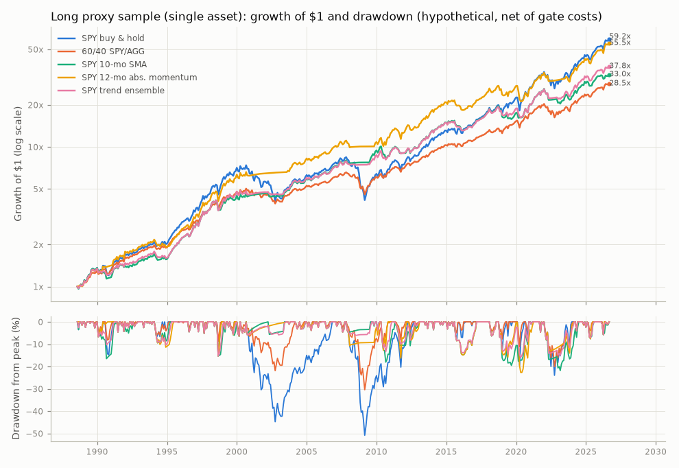
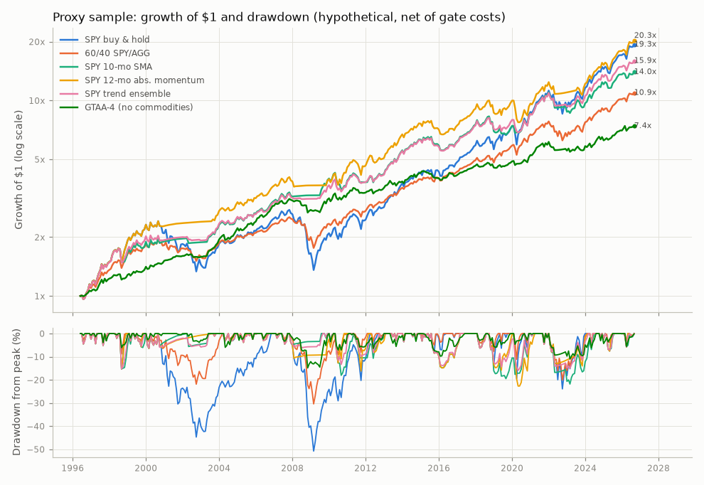
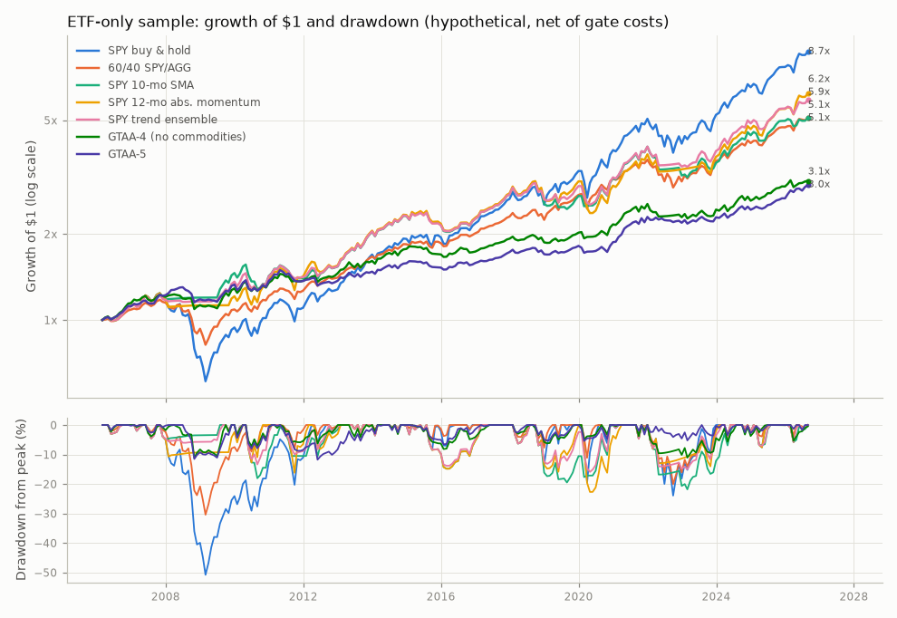

# Backtest summary

> **Important: hypothetical backtested performance.** Every number in this report is a *simulation* of what the stated rules would have done on historical data. No money was traded. Simulated results have inherent limitations: they are produced with hindsight, cannot reflect real fills, taxes or the behaviour of a person following the rules through losses, and are known to overstate live results.
>
> - **Costs modelled (results are net of these):** half-spread per instrument floored at 5 bp per side (the Gate A floor), Alpaca pass-through regulatory fees (SEC, FINRA TAF, CAT; each rounded up to the cent per day), Alpaca's $1 minimum on buy orders (sells have no minimum), $10,000 starting capital, fractional shares, fills at the next day's open; fund expense ratios are inside fund prices. Taxes, market impact and dividend withholding are NOT modelled. Results at 2x these costs are also shown.
> - **Sample period:** Long proxy sample (single asset) 1988-08..2026-08; Proxy sample 1996-06..2026-08; ETF-only sample 2006-03..2026-08
> - **Benchmark shown alongside every strategy:** SPY buy-and-hold (total return, same engine and costs); also a 60/40 SPY/AGG reference
> - **Worst drawdown in these results:** -55.2% (SPY buy & hold, Proxy sample, daily closes)
> - **Number of variants tried (trial ledger):** 546 unique variants in results/trial_ledger.json (long: 38, proxy: 392, etf: 116). The more variants tried, the more the best one is flattered by luck; see dsr_pbo.md for the correction.
> - **Past performance does not indicate future results.** Nothing here is investment advice.
> - Generated by `scripts/run_backtests.py` (deterministic Python, no language model) on 2026-09-29 (UTC date).

## Samples

Each sample starts in cash at the close of the first signal month-end; monthly returns start the month after. Timing: signal on the last trading day's close, fill at the next day's open.

| sample | data | first signal | returns | years | strategies |
|---|---|---|---|---|---|
| Long proxy sample (single asset) | ETFs + validated mutual-fund proxies | 1988-07 | 1988-08..2026-08 | 38.1 | spy_buy_hold, sixty_forty, trend_sma10, trend_absmom12, trend_ensemble |
| Proxy sample | ETFs + validated mutual-fund proxies | 1996-05 | 1996-06..2026-08 | 30.2 | spy_buy_hold, sixty_forty, trend_sma10, trend_absmom12, trend_ensemble, gtaa4 |
| ETF-only sample | ETF prices only | 2006-02 | 2006-03..2026-08 | 20.5 | spy_buy_hold, sixty_forty, trend_sma10, trend_absmom12, trend_ensemble, gtaa4, gtaa5 |

Panel construction per sample:

- **Long proxy sample (single asset)**: SPY spliced with VFINX returns through 1993-01-29; AGG spliced with VBMFX returns through 2003-09-30
- **Proxy sample**: SPY spliced with VFINX returns through 1993-01-29; AGG spliced with VBMFX returns through 2003-09-30; VGTSX substituted for EFA (whole period; no splice); IEF spliced with VFITX returns through 2002-07-31; VNQ spliced with VGSIX returns through 2004-09-30
- **ETF-only sample**: SPY vendor series; AGG vendor series; EFA vendor series; IEF vendor series; VNQ vendor series; DBC vendor series

The single-asset SPY series in the long proxy sample starts in 1987 (VFINX before 1993-02): Yahoo's VFINX history before 1987 failed the Ken French cross-check (see crosscheck.md) and is not used.

## Headline metrics: Long proxy sample (single asset)

| strategy | CAGR | Vol | Sharpe | Sortino | MaxDD | DD months | Calmar | Hit rate | Turnover/yr | Switches/yr | Exposure | Beta | Corr | TE | CAGR 2x cost | Sharpe 2x cost |
|---|---|---|---|---|---|---|---|---|---|---|---|---|---|---|---|---|
| SPY buy & hold | 11.3% | 14.6% | 0.61 | 0.92 | -55.2% | 74 | 0.20 | 65% | 0.00 | 0.00 | 100% | 1.00 | 1.00 | 0.0% | 11.3% | 0.61 |
| 60/40 SPY/AGG | 9.2% | 9.2% | 0.69 | 1.05 | -33.8% | 49 | 0.27 | 66% | 0.07 | 0.00 | 100% | 0.62 | 0.98 | 5.9% | 9.2% | 0.69 |
| SPY 10-mo SMA | 9.6% | 10.8% | 0.64 | 0.97 | -24.4% | 32 | 0.39 | 72% | 1.42 | 1.42 | 79% | 0.54 | 0.73 | 10.0% | 9.5% | 0.63 |
| SPY 12-mo abs. momentum | 11.1% | 11.6% | 0.72 | 1.17 | -33.7% | 35 | 0.33 | 73% | 0.68 | 0.71 | 80% | 0.61 | 0.77 | 9.3% | 11.1% | 0.72 |
| SPY trend ensemble | 10.0% | 10.3% | 0.70 | 1.08 | -21.2% | 38 | 0.47 | 70% | 1.25 | 4.44 | 78% | 0.55 | 0.78 | 9.3% | 9.9% | 0.69 |

## Headline metrics: Proxy sample

| strategy | CAGR | Vol | Sharpe | Sortino | MaxDD | DD months | Calmar | Hit rate | Turnover/yr | Switches/yr | Exposure | Beta | Corr | TE | CAGR 2x cost | Sharpe 2x cost |
|---|---|---|---|---|---|---|---|---|---|---|---|---|---|---|---|---|
| SPY buy & hold | 10.3% | 15.3% | 0.57 | 0.85 | -55.2% | 74 | 0.19 | 64% | 0.00 | 0.00 | 100% | 1.00 | 1.00 | 0.0% | 10.3% | 0.57 |
| 60/40 SPY/AGG | 8.2% | 9.5% | 0.64 | 0.97 | -33.8% | 49 | 0.24 | 65% | 0.07 | 0.00 | 100% | 0.61 | 0.98 | 6.3% | 8.2% | 0.64 |
| SPY 10-mo SMA | 9.1% | 11.0% | 0.64 | 0.98 | -24.4% | 32 | 0.37 | 73% | 1.39 | 1.39 | 77% | 0.51 | 0.71 | 10.8% | 9.0% | 0.64 |
| SPY 12-mo abs. momentum | 10.5% | 11.9% | 0.71 | 1.13 | -33.7% | 35 | 0.31 | 73% | 0.53 | 0.53 | 79% | 0.59 | 0.76 | 10.0% | 10.4% | 0.71 |
| SPY trend ensemble | 9.6% | 10.5% | 0.71 | 1.10 | -21.2% | 38 | 0.45 | 70% | 1.20 | 4.40 | 76% | 0.52 | 0.76 | 10.1% | 9.5% | 0.70 |
| GTAA-4 (no commodities) | 6.8% | 7.2% | 0.64 | 0.95 | -17.7% | 30 | 0.39 | 67% | 1.75 | 5.02 | 71% | 0.30 | 0.63 | 12.1% | 6.7% | 0.63 |

## Headline metrics: ETF-only sample

| strategy | CAGR | Vol | Sharpe | Sortino | MaxDD | DD months | Calmar | Hit rate | Turnover/yr | Switches/yr | Exposure | Beta | Corr | TE | CAGR 2x cost | Sharpe 2x cost |
|---|---|---|---|---|---|---|---|---|---|---|---|---|---|---|---|---|
| SPY buy & hold | 11.1% | 15.1% | 0.67 | 1.00 | -55.2% | 52 | 0.20 | 67% | 0.00 | 0.00 | 100% | 1.00 | 1.00 | 0.0% | 11.1% | 0.66 |
| 60/40 SPY/AGG | 8.3% | 9.6% | 0.70 | 1.06 | -33.8% | 37 | 0.24 | 67% | 0.07 | 0.00 | 100% | 0.62 | 0.98 | 6.0% | 8.3% | 0.70 |
| SPY 10-mo SMA | 8.3% | 10.7% | 0.64 | 0.97 | -24.4% | 32 | 0.34 | 73% | 1.56 | 1.56 | 80% | 0.49 | 0.69 | 11.0% | 8.2% | 0.63 |
| SPY 12-mo abs. momentum | 9.3% | 11.9% | 0.67 | 1.04 | -33.7% | 29 | 0.28 | 73% | 0.68 | 0.68 | 83% | 0.59 | 0.76 | 9.9% | 9.3% | 0.67 |
| SPY trend ensemble | 9.0% | 10.2% | 0.74 | 1.14 | -21.2% | 25 | 0.43 | 71% | 1.28 | 4.34 | 79% | 0.50 | 0.74 | 10.2% | 9.0% | 0.73 |
| GTAA-4 (no commodities) | 5.6% | 7.3% | 0.56 | 0.81 | -14.2% | 30 | 0.39 | 66% | 1.91 | 5.32 | 71% | 0.31 | 0.64 | 11.8% | 5.5% | 0.54 |
| GTAA-5 | 5.5% | 6.6% | 0.58 | 0.88 | -14.5% | 33 | 0.38 | 64% | 1.90 | 6.44 | 68% | 0.28 | 0.63 | 12.1% | 5.4% | 0.57 |

Column notes: CAGR/Vol/Sharpe/Sortino annualized from monthly returns (Sharpe and Sortino vs T-bills); MaxDD from daily closes; DD months = longest spell below a month-end peak; Turnover/yr = (buys + sells) / equity summed per year, excluding the initial purchase; Switches/yr = rebalances whose target weights changed; Exposure = average month-end weight in risky assets; Beta/Corr/TE vs SPY buy-and-hold.

## Annual returns: Proxy sample

(* = partial year)

| year | SPY buy & hold | 60/40 SPY/AGG | SPY 10-mo SMA | SPY 12-mo abs. momentum | SPY trend ensemble | GTAA-4 (no commodities) |
|---|---|---|---|---|---|---|
| 1996* | 12.1% | 9.8% | 12.1% | 12.1% | 11.5% | 5.7% |
| 1997 | 33.5% | 23.9% | 33.5% | 33.5% | 33.5% | 16.2% |
| 1998 | 28.7% | 20.7% | 11.9% | 28.7% | 16.0% | 4.6% |
| 1999 | 20.4% | 12.0% | 13.2% | 20.4% | 17.1% | 9.9% |
| 2000 | -9.7% | -1.1% | 0.4% | -1.6% | -4.4% | 7.3% |
| 2001 | -11.8% | -3.7% | 3.4% | 3.4% | 3.5% | 5.9% |
| 2002 | -21.6% | -9.5% | -4.2% | 1.6% | -3.9% | -0.9% |
| 2003 | 28.2% | 18.4% | 22.9% | 13.8% | 22.1% | 22.5% |
| 2004 | 10.7% | 7.9% | 9.0% | 10.7% | 8.4% | 14.2% |
| 2005 | 4.8% | 3.8% | 4.8% | 4.8% | 3.0% | 8.0% |
| 2006 | 15.8% | 11.1% | 15.8% | 15.8% | 15.3% | 20.5% |
| 2007 | 5.1% | 5.7% | 5.1% | 5.1% | 5.2% | 6.4% |
| 2008 | -36.8% | -18.9% | 1.5% | -4.6% | -1.2% | -10.5% |
| 2009 | 26.4% | 16.8% | 22.0% | 7.7% | 17.4% | 14.7% |
| 2010 | 15.1% | 11.6% | -2.3% | 15.1% | 4.4% | 5.4% |
| 2011 | 1.9% | 4.3% | -1.9% | 1.9% | -0.7% | 1.5% |
| 2012 | 16.0% | 11.0% | 10.0% | 9.3% | 9.1% | 5.7% |
| 2013 | 32.3% | 18.5% | 32.3% | 32.3% | 32.3% | 7.7% |
| 2014 | 13.5% | 10.4% | 13.5% | 13.5% | 13.5% | 10.6% |
| 2015 | 1.2% | 0.9% | -6.7% | -6.8% | -7.4% | -6.1% |
| 2016 | 12.0% | 8.2% | 4.9% | 4.9% | 5.4% | 3.8% |
| 2017 | 21.7% | 14.4% | 21.7% | 21.7% | 21.7% | 11.6% |
| 2018 | -4.6% | -2.6% | -7.4% | -4.6% | -3.9% | -2.1% |
| 2019 | 31.2% | 22.2% | 6.7% | 15.4% | 11.4% | 7.7% |
| 2020 | 18.3% | 14.0% | 15.5% | -3.4% | 7.3% | 7.6% |
| 2021 | 28.7% | 16.5% | 28.7% | 28.7% | 28.1% | 16.8% |
| 2022 | -18.2% | -16.1% | -20.7% | -11.4% | -14.9% | -9.8% |
| 2023 | 26.2% | 18.0% | 10.7% | 10.7% | 13.4% | 5.4% |
| 2024 | 24.9% | 15.5% | 24.9% | 24.9% | 24.9% | 7.0% |
| 2025 | 17.7% | 13.5% | 12.3% | 17.7% | 12.7% | 12.4% |
| 2026* | 13.1% | 7.8% | 2.7% | 13.1% | 7.2% | 5.3% |

## Annual returns: ETF-only sample

(* = partial year)

| year | SPY buy & hold | 60/40 SPY/AGG | SPY 10-mo SMA | SPY 12-mo abs. momentum | SPY trend ensemble | GTAA-4 (no commodities) | GTAA-5 |
|---|---|---|---|---|---|---|---|
| 2006* | 12.1% | 8.7% | 12.1% | 12.1% | 11.6% | 14.6% | 11.8% |
| 2007 | 5.1% | 5.7% | 5.1% | 5.1% | 5.2% | 5.1% | 9.3% |
| 2008 | -36.8% | -18.9% | 1.5% | -4.6% | -1.2% | -6.4% | -3.3% |
| 2009 | 26.4% | 16.8% | 22.0% | 7.7% | 17.4% | 14.4% | 12.6% |
| 2010 | 15.1% | 11.6% | -2.3% | 15.1% | 4.4% | 4.6% | 3.0% |
| 2011 | 1.9% | 4.3% | -1.9% | 1.9% | -0.7% | 1.6% | -0.1% |
| 2012 | 16.0% | 11.0% | 10.0% | 9.3% | 9.1% | 6.2% | 0.2% |
| 2013 | 32.3% | 18.5% | 32.3% | 32.3% | 32.3% | 10.5% | 7.6% |
| 2014 | 13.5% | 10.4% | 13.5% | 13.5% | 13.5% | 10.2% | 7.0% |
| 2015 | 1.2% | 0.9% | -6.7% | -6.8% | -7.4% | -4.4% | -3.5% |
| 2016 | 12.0% | 8.2% | 4.9% | 4.9% | 5.4% | 2.3% | 3.8% |
| 2017 | 21.7% | 14.4% | 21.7% | 21.7% | 21.7% | 11.0% | 9.2% |
| 2018 | -4.6% | -2.6% | -7.4% | -4.6% | -3.9% | -2.9% | -1.7% |
| 2019 | 31.2% | 22.2% | 6.7% | 15.4% | 11.4% | 8.2% | 6.9% |
| 2020 | 18.3% | 14.0% | 15.5% | -3.4% | 7.3% | 6.9% | 3.1% |
| 2021 | 28.7% | 16.5% | 28.7% | 28.7% | 28.1% | 17.9% | 22.5% |
| 2022 | -18.2% | -16.1% | -20.7% | -11.4% | -14.9% | -10.1% | -4.6% |
| 2023 | 26.2% | 18.0% | 10.7% | 10.7% | 13.4% | 6.3% | 4.5% |
| 2024 | 24.9% | 15.5% | 24.9% | 24.9% | 24.9% | 7.4% | 6.3% |
| 2025 | 17.7% | 13.5% | 12.3% | 17.7% | 12.7% | 12.1% | 9.6% |
| 2026* | 13.1% | 7.8% | 2.7% | 13.1% | 7.2% | 4.7% | 11.5% |

## Annual returns: Long proxy sample (single asset)

(* = partial year)

| year | SPY buy & hold | 60/40 SPY/AGG | SPY 10-mo SMA | SPY 12-mo abs. momentum | SPY trend ensemble |
|---|---|---|---|---|---|
| 1988* | 3.7% | 3.5% | 3.7% | 2.1% | 2.7% |
| 1989 | 31.5% | 24.4% | 31.5% | 31.5% | 30.9% |
| 1990 | -3.3% | 1.7% | -14.4% | 5.5% | -8.1% |
| 1991 | 30.3% | 24.5% | 20.5% | 25.8% | 19.3% |
| 1992 | 8.3% | 7.9% | 8.2% | 8.3% | 7.5% |
| 1993 | 8.8% | 9.2% | 8.8% | 8.8% | 8.8% |
| 1994 | 0.4% | -0.8% | -5.0% | -7.8% | -6.7% |
| 1995 | 38.0% | 30.2% | 37.6% | 29.6% | 35.0% |
| 1996 | 22.5% | 15.0% | 22.5% | 22.5% | 21.9% |
| 1997 | 33.5% | 23.9% | 33.5% | 33.5% | 33.5% |
| 1998 | 28.7% | 20.7% | 11.9% | 28.7% | 16.0% |
| 1999 | 20.4% | 12.0% | 13.2% | 20.4% | 17.1% |
| 2000 | -9.7% | -1.1% | 0.4% | -1.6% | -4.4% |
| 2001 | -11.8% | -3.7% | 3.4% | 3.4% | 3.5% |
| 2002 | -21.6% | -9.5% | -4.2% | 1.6% | -3.9% |
| 2003 | 28.2% | 18.4% | 22.9% | 13.8% | 22.1% |
| 2004 | 10.7% | 7.9% | 9.0% | 10.7% | 8.4% |
| 2005 | 4.8% | 3.8% | 4.8% | 4.8% | 3.0% |
| 2006 | 15.8% | 11.1% | 15.8% | 15.8% | 15.3% |
| 2007 | 5.1% | 5.7% | 5.1% | 5.1% | 5.2% |
| 2008 | -36.8% | -18.9% | 1.5% | -4.6% | -1.2% |
| 2009 | 26.4% | 16.8% | 22.0% | 7.7% | 17.4% |
| 2010 | 15.1% | 11.6% | -2.3% | 15.1% | 4.4% |
| 2011 | 1.9% | 4.3% | -1.9% | 1.9% | -0.7% |
| 2012 | 16.0% | 11.0% | 10.0% | 9.3% | 9.1% |
| 2013 | 32.3% | 18.5% | 32.3% | 32.3% | 32.3% |
| 2014 | 13.5% | 10.4% | 13.5% | 13.5% | 13.5% |
| 2015 | 1.2% | 0.9% | -6.7% | -6.8% | -7.4% |
| 2016 | 12.0% | 8.2% | 4.9% | 4.9% | 5.4% |
| 2017 | 21.7% | 14.4% | 21.7% | 21.7% | 21.7% |
| 2018 | -4.6% | -2.6% | -7.4% | -4.6% | -3.9% |
| 2019 | 31.2% | 22.2% | 6.7% | 15.4% | 11.4% |
| 2020 | 18.3% | 14.0% | 15.5% | -3.4% | 7.3% |
| 2021 | 28.7% | 16.5% | 28.7% | 28.7% | 28.1% |
| 2022 | -18.2% | -16.1% | -20.7% | -11.4% | -14.9% |
| 2023 | 26.2% | 18.0% | 10.7% | 10.7% | 13.4% |
| 2024 | 24.9% | 15.5% | 24.9% | 24.9% | 24.9% |
| 2025 | 17.7% | 13.5% | 12.3% | 17.7% | 12.7% |
| 2026* | 13.1% | 7.8% | 2.7% | 13.1% | 7.2% |

## Regime slices

Compounded return over the months listed (both ends inclusive).

### Long proxy sample (single asset)

| regime | months | SPY buy & hold | 60/40 SPY/AGG | SPY 10-mo SMA | SPY 12-mo abs. momentum | SPY trend ensemble |
|---|---|---|---|---|---|---|
| Dot-com bust | 2000-03..2002-09 | -38.4% | -15.0% | 5.9% | 10.2% | 2.2% |
| Global financial crisis | 2007-10..2009-03 | -46.0% | -25.9% | -2.1% | -8.1% | -4.4% |
| 2009 rebound (momentum crash) | 2009-03..2009-12 | 54.2% | 33.0% | 21.9% | 7.7% | 17.3% |
| COVID crash | 2020-02..2020-04 | -9.2% | -4.3% | -7.3% | -22.5% | -13.8% |
| 2022 rate shock | 2022-01..2022-12 | -18.2% | -16.1% | -20.7% | -11.4% | -14.9% |

### Proxy sample

| regime | months | SPY buy & hold | 60/40 SPY/AGG | SPY 10-mo SMA | SPY 12-mo abs. momentum | SPY trend ensemble | GTAA-4 (no commodities) |
|---|---|---|---|---|---|---|---|
| Dot-com bust | 2000-03..2002-09 | -38.4% | -15.0% | 5.9% | 10.2% | 2.2% | 14.8% |
| Global financial crisis | 2007-10..2009-03 | -46.0% | -25.9% | -2.1% | -8.1% | -4.4% | -10.5% |
| 2009 rebound (momentum crash) | 2009-03..2009-12 | 54.2% | 33.0% | 21.9% | 7.7% | 17.3% | 16.0% |
| COVID crash | 2020-02..2020-04 | -9.2% | -4.3% | -7.3% | -22.5% | -13.8% | -3.1% |
| 2022 rate shock | 2022-01..2022-12 | -18.2% | -16.1% | -20.7% | -11.4% | -14.9% | -9.8% |

### ETF-only sample

| regime | months | SPY buy & hold | 60/40 SPY/AGG | SPY 10-mo SMA | SPY 12-mo abs. momentum | SPY trend ensemble | GTAA-4 (no commodities) | GTAA-5 |
|---|---|---|---|---|---|---|---|---|
| Dot-com bust | 2000-03..2002-09 | n/a | n/a | n/a | n/a | n/a | n/a | n/a |
| Global financial crisis | 2007-10..2009-03 | -46.0% | -25.9% | -2.1% | -8.1% | -4.4% | -6.7% | -0.7% |
| 2009 rebound (momentum crash) | 2009-03..2009-12 | 54.2% | 33.0% | 21.9% | 7.7% | 17.3% | 15.7% | 13.6% |
| COVID crash | 2020-02..2020-04 | -9.2% | -4.3% | -7.3% | -22.5% | -13.8% | -3.7% | -3.1% |
| 2022 rate shock | 2022-01..2022-12 | -18.2% | -16.1% | -20.7% | -11.4% | -14.9% | -10.1% | -4.6% |

## Post-publication split at 2006-01-01 (pre-registered: Faber's publication year)

### Long proxy sample (single asset) (pre = 1988-08..2005-12, post = 2006-01..end; MaxDD from month-ends)

| strategy | pre CAGR | pre Sharpe | pre MaxDD | post CAGR | post Sharpe | post MaxDD |
|---|---|---|---|---|---|---|
| SPY buy & hold | 11.4% | 0.53 | -44.7% | 11.2% | 0.67 | -50.8% |
| 60/40 SPY/AGG | 10.3% | 0.66 | -21.9% | 8.3% | 0.71 | -30.4% |
| SPY 10-mo SMA | 11.1% | 0.62 | -16.5% | 8.4% | 0.65 | -21.8% |
| SPY 12-mo abs. momentum | 13.2% | 0.78 | -15.3% | 9.4% | 0.68 | -22.7% |
| SPY trend ensemble | 11.1% | 0.64 | -15.3% | 9.1% | 0.74 | -15.9% |

### Proxy sample (pre = 1996-06..2005-12, post = 2006-01..end; MaxDD from month-ends)

| strategy | pre CAGR | pre Sharpe | pre MaxDD | post CAGR | post Sharpe | post MaxDD |
|---|---|---|---|---|---|---|
| SPY buy & hold | 8.3% | 0.36 | -44.7% | 11.2% | 0.67 | -50.8% |
| 60/40 SPY/AGG | 8.1% | 0.50 | -21.9% | 8.3% | 0.71 | -30.4% |
| SPY 10-mo SMA | 10.7% | 0.63 | -15.3% | 8.4% | 0.65 | -21.8% |
| SPY 12-mo abs. momentum | 12.8% | 0.78 | -15.3% | 9.4% | 0.68 | -22.7% |
| SPY trend ensemble | 10.6% | 0.64 | -15.3% | 9.1% | 0.74 | -15.9% |
| GTAA-4 (no commodities) | 9.6% | 0.88 | -6.1% | 5.6% | 0.55 | -14.9% |

## GTAA rebalance-day luck (tranching)

Same rule (10-month SMA), signal evaluated on each trading-day offset 0..20 of the month. 'Tranched' runs 21 sub-accounts of $10,000/21, each on its own day. Details in plateau.md.

| sample / strategy | month_end_cagr | min_cagr | max_cagr | spread_bp | std_bp | best_day | worst_day | tranched_cagr | tranched_sharpe | tranched_max_dd |
|---|---|---|---|---|---|---|---|---|---|---|
| proxy / gtaa4 | 6.8% | 5.7% | 7.6% | 182 | 50 | 17 | 12 | 6.7% | 0.62 | -16.2% |
| etf / gtaa4 | 5.6% | 4.4% | 6.5% | 209 | 51 | 17 | 12 | 5.4% | 0.53 | -16.1% |
| etf / gtaa5 | 5.5% | 4.9% | 6.6% | 173 | 41 | 17 | 10 | 5.6% | 0.59 | -13.4% |

## Gate A scorecard (pre-registered in docs/research-report.md section 12)

A candidate may be paper-traded only if it passes every row. Definitions are in docs/methodology.md.

| sample / candidate | A1 pre-registered | A2 >=15y, 2008/20/22, >=5bp, 2x costs | wf_sharpe | A3 WF Sharpe>=0.5 & beats B&H | dsr | pbo | A4 DSR>=0.95 & PBO<=0.2 | plateau | A5 plateau>=0.7 | A6 boot p5 CAGR>0 & p95 DD<=B&H | 5y windows won (of 3) | A7 2008 & 2022 & >=2/3 5y | A8 leakage | verdict |
|---|---|---|---|---|---|---|---|---|---|---|---|---|---|---|
| proxy / trend_sma10 | PASS | PASS | 0.65 | PASS | 0.98 | 0.87 | FAIL | 1.00 | PASS | PASS | 0 | FAIL | PASS | REJECTED (A4, A7) |
| proxy / trend_absmom12 | PASS | PASS | 0.56 | PASS | 0.99 | 0.87 | FAIL | 0.89 | PASS | PASS | 0 | FAIL | PASS | REJECTED (A4, A7) |
| proxy / trend_ensemble | PASS | PASS | 0.73 | PASS | 0.99 | 0.87 | FAIL | n/a | n/a | PASS | 0 | FAIL | PASS | REJECTED (A4, A7) |
| proxy / gtaa4 | PASS | PASS | 0.69 | PASS | 0.98 | 0.66 | FAIL | 0.94 | PASS | PASS | 0 | FAIL | PASS | REJECTED (A4, A7) |
| etf / gtaa5 | PASS | PASS | 0.56 | FAIL | 0.92 | 0.49 | FAIL | 0.91 | PASS | PASS | 0 | FAIL | PASS | REJECTED (A3, A4, A7) |

## Charts

## Other result files

scaling.md, plateau.md, walkforward.md, bootstrap.md, dsr_pbo.md, leakage.md, crosscheck.md, trial_ledger.json, metrics_*.csv, annual_returns_*.csv, data_manifest.json.
